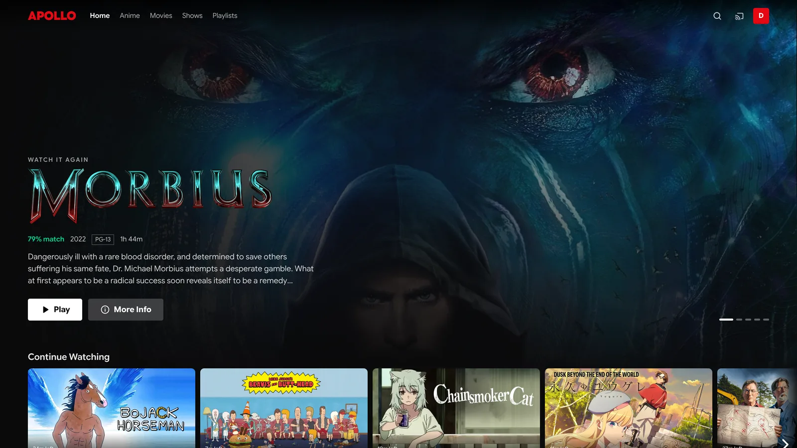
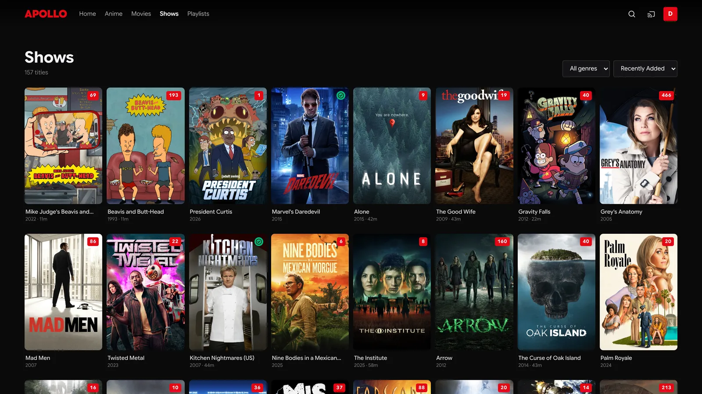
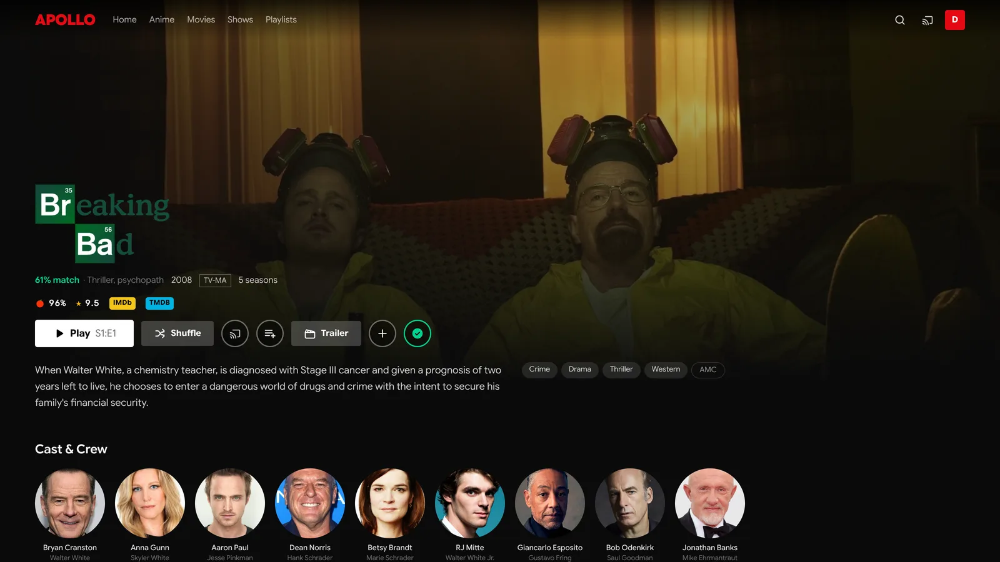
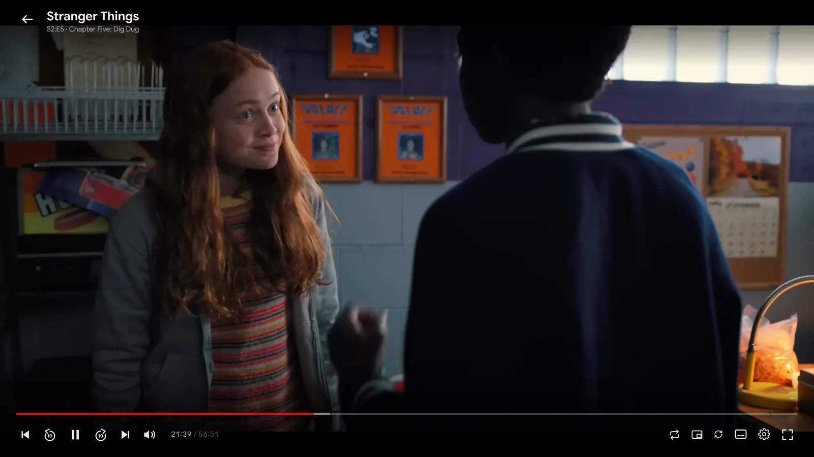
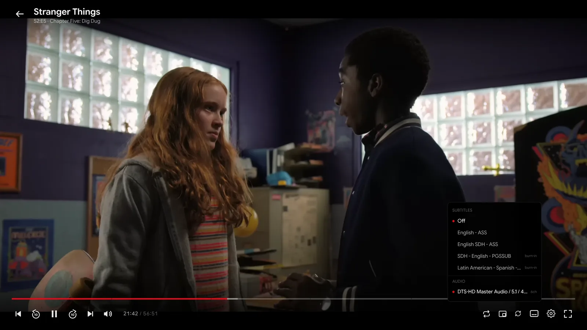
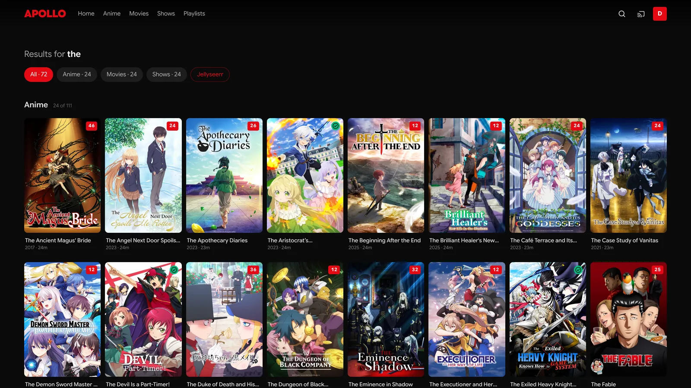

# Apollo

A modern, Netflix-style web client for Jellyfin — full-bleed hero, hover-expand
cards, a real player, and a complete admin dashboard.

Unofficial and not affiliated with the Jellyfin project. It talks to the standard
Jellyfin REST API and runs alongside (or instead of) the official web UI.

Built against **Jellyfin 10.11.8**, with endpoints verified against that server's
own OpenAPI document — which matters, because 10.11 removed the legacy
`/Users/{userId}/...` routes that older documentation still describes.



## Screenshots

<table>
  <tr>
    <td width="50%"></td>
    <td width="50%"></td>
  </tr>
  <tr>
    <td>Library, with unwatched counts, genre filter and sorting</td>
    <td>Series detail — external ratings, trailer, playlists, cast and crew</td>
  </tr>
  <tr>
    <td></td>
    <td></td>
  </tr>
  <tr>
    <td>The player. Chapters mark the scrubber; skip ranges sit alongside them</td>
    <td>Subtitles and audio, labelled where a track has to be burned in</td>
  </tr>
</table>



Search groups by library and counts each one, with a Jellyseerr filter for
things you do not have yet.

## Try it without installing anything

**<https://dpilat-dev.github.io/Apollo/>** — the live build, which asks for your
own server address and talks to it directly from your browser. Nothing is
proxied through GitHub and no credentials are stored anywhere but your browser.

One hard limitation: the demo is served over HTTPS, so browsers will refuse to
let it reach a plain-HTTP server. It works if your Jellyfin is behind HTTPS with
a valid certificate; a bare `http://192.168.x.x:8096` will be blocked, and no
client-side code can get around that rule. Self-host (below) to use Apollo on a
LAN address.

The demo also has no Jellyseerr integration, since that needs the small Node
server to proxy around Jellyseerr's missing CORS headers.

## Quick start

```bash
git clone <your-fork> apollo && cd apollo
cp .env.example .env          # point VITE_JELLYFIN_SERVER at your server
npm install
npm run dev                   # http://localhost:5173
```

Production:

```bash
npm run build
npm run serve                 # http://localhost:4173
```

`npm run serve` runs a small Node server that serves the built files *and*
proxies Jellyseerr. It has no runtime dependencies beyond Node itself. A plain
static host works too, but loses the editable Jellyseerr address.

`VITE_JELLYFIN_SERVER` only prefills the sign-in form — anyone can enter a
different address there, and the choice is stored per browser.

## Environment variables

| Variable | Where | Default | What it does |
| --- | --- | --- | --- |
| `VITE_JELLYFIN_SERVER` | `.env`, **build time** | empty | Prefills the sign-in form. Baked into the bundle, so changing it needs a rebuild. Anyone can still type a different address at sign-in. |
| `VITE_JELLYSEERR_TARGET` | `.env`, build time | empty | Only seeds the Jellyseerr address on first run. After that `apollo.runtime.json` wins. |
| `PORT` | server, runtime | `4173` | Port the Node server listens on. |
| `APOLLO_CONFIG` | server, runtime | `./apollo.runtime.json` | Where the runtime config is written. Point at a mounted volume in a container. |
| `APOLLO_DIST` | server, runtime | `./dist` | Where the built files are. |

`VITE_*` are read by Vite at **build** time; the rest are read by the server at
**run** time. That distinction matters: changing `VITE_JELLYFIN_SERVER` requires
`npm run build`, while `PORT` only needs a restart.

The Jellyseerr address is the exception — it lives in `apollo.runtime.json` and
is editable from Dashboard → Connections without touching either.

## Deploying

### Docker

```bash
docker compose up -d --build
```

The named volume keeps `apollo.runtime.json` — and therefore the Jellyseerr
address — across rebuilds.

#### Proxmox: one command

On the **Proxmox host**:

```bash
bash -c "$(curl -fsSL https://raw.githubusercontent.com/DPilat-Dev/Apollo/main/scripts/proxmox-install.sh)"
```

It prompts for everything — container ID, resources, storage, network, and your
Jellyfin address — with a default for each. It creates an unprivileged Debian
container, installs Node, builds Apollo, and starts it under systemd.

Non-interactive:

```bash
CTID=120 JELLYFIN_URL=https://jellyfin.example.com \
  bash -c "$(curl -fsSL .../scripts/proxmox-install.sh)" -- --yes
```

Manual steps, if you'd rather do it yourself:
[docs/proxmox-lxc.md](docs/proxmox-lxc.md).

### LXC or VM, no Docker

```bash
adduser --system --group apollo
git clone <your-fork> /opt/apollo && cd /opt/apollo
npm ci && npm run build
chown -R apollo:apollo /opt/apollo
git config --global --add safe.directory /opt/apollo
cp apollo.service /etc/systemd/system/
systemctl enable --now apollo
```

Updating afterwards is one command, run as root:

```bash
/opt/apollo/scripts/update.sh
```

It moves to the **latest release tag**, not to the tip of `main`. A server people
actually watch things on should not follow every commit — that includes work in
progress, and anything pushed between a bug being introduced and being noticed.

```bash
/opt/apollo/scripts/update.sh              # latest release
/opt/apollo/scripts/update.sh --edge       # current main, unreleased
/opt/apollo/scripts/update.sh --ref v1.0.0 # pin to a version, or roll back
/opt/apollo/scripts/update.sh --force      # rebuild even if nothing changed
```

Running it when the server is already on the target version does nothing, rather
than rebuilding and bouncing the service under whoever is watching. `.env` and
`apollo.runtime.json` are untracked, so they survive every path through this.

### Secure contexts

Several browser APIs exist only on HTTPS or `localhost`. Apollo avoids them, but
it is worth knowing why: `crypto.randomUUID` — used to label this browser in
Jellyfin's device list — is undefined when a page is served over plain HTTP on a
LAN address. It is called while building the `Authorization` header, so it threw
before any authenticated request was sent.

The symptom was deeply confusing: unauthenticated calls (`/System/Info/Public`,
`/Branding/Configuration`) succeeded, so the server appeared connected and
reported its version — while every authenticated call, including sign-in,
silently never happened. `getRandomValues` has no such restriction and is the
fallback.

Development on `localhost` never sees this, because localhost counts as a secure
context. Test on a real LAN address before deploying.

### Mixed content — read this before putting it behind HTTPS

The browser talks to Jellyfin **directly**. If Apollo is served over HTTPS and
`VITE_JELLYFIN_SERVER` is a plain `http://` LAN address, browsers block every
request as mixed content and the app appears completely broken.

Pick one:

- Point Apollo at an HTTPS Jellyfin address (`https://jellyfin.example.com`)
- Serve Apollo over plain HTTP on the LAN
- Put both behind the same reverse proxy and origin

This bites the moment you add a public hostname, and the symptom — everything
failing at once, with CORS-looking console errors — does not obviously say
"mixed content".

## Stack

| Piece | Choice | Why |
| --- | --- | --- |
| Build | Vite + React 19 + TypeScript | Static SPA; no server needed at runtime |
| Styling | Tailwind CSS v4 | Design tokens live in `src/index.css` under `@theme` |
| Data | TanStack Query | Caching, dedupe, and infinite scroll for libraries |
| Playback | `hls.js` | Transcoded streams; direct play uses the native element |
| Types | `@jellyfin/sdk` | Generated DTOs only — HTTP goes through our own thin client |

The SDK's generated axios client is not used. A hand-rolled `fetch` wrapper
(`src/lib/api.ts`) keeps full control of URL shape and auth headers, which the
image and streaming URLs depend on.

## Layout

```
src/
  lib/
    api.ts                 JellyfinApi client, auth, image + stream URL builders
    auth.tsx               Session context, persisted to localStorage
    playback.ts            PlaybackInfo -> direct play / direct stream / transcode
    useProgressReporter.ts Start/progress/stopped reporting to the server
    queries.ts             TanStack Query hooks
    format.ts              Ticks, timecodes, progress fractions
  components/
    Billboard.tsx          Rotating full-bleed hero
    Row.tsx                Horizontal carousel with paged arrows
    MediaCard.tsx          Tile with hover-expand detail tray
    TopNav.tsx             Transparent-to-solid nav with inline search
  routes/
    Login.tsx  Home.tsx  Library.tsx  ItemDetail.tsx  Search.tsx  Player.tsx
    Settings.tsx  Admin.tsx
```

## Match score

The percentage on cards, the hero and detail pages is a real per-user score
(`src/lib/taste.ts`), not a relabelled community rating.

A taste profile is built once per session from the user's 150 most recently
played titles plus their favourites, counting **genres, studios and tags**.
Favourites weigh 3× a play, rewatches get a bonus, and recent viewing counts
about double the oldest in the window. Raw counts are square-root damped and
normalised against the strongest term, so one heavily-watched genre doesn't
flatten everything else to zero.

Scoring a candidate blends its facet affinities (75%) with the community rating
as a prior (25%). Only facets the item actually carries are scored, renormalised
by their weights — otherwise an item with no tags would be punished for the
omission rather than judged on what it has.

Deliberate choices worth knowing:

- **Cast and directors are excluded.** The `People` field is large, so rows
  don't request it, and scoring on a facet only the detail page carries would
  show two different numbers for the same title.
- **No floor.** The old fake score clamped to 50–99 so nothing ever looked bad.
  Real scores run 1–99.
- **Cold start is honest.** Under 5 watched items there is no profile, so the UI
  shows `★ 8.1` instead of inventing a match.
- **Tuning matters.** With the peak term at 40% and a lenient curve, a
  romance/drama scored 82% for a sci-fi viewer who had watched one drama.
  `PEAK_SHARE` and `AFFINITY_FOR_FULL_MARKS` exist to stop that.

Detail pages also show *why*: "90% match · Sci-Fi, Paramount".

## Home rows

Continue Watching, Next Up, Recently Added, Top Rated, then one **Recently Added
in {Library}** row per library (`/Items/Latest`, grouped so a TV library shows
series rather than 40 loose episodes), then My List and an unwatched shelf.

The hero is drawn from **what this person actually watches**: titles they are
part-way through, plus a random pick of ones they have finished. It labels
itself — "Continue watching · S2:E3" with a progress bar and a Resume button, or
"Watch it again" — because an unexplained rewatch suggestion reads as a bug.

Randomness comes from two places: `sortBy: Random` on the server for the watched
pool, and a client shuffle seeded once per mount. The seed matters — shuffling on
every render would reorder the hero mid-view.

Backdrop art is a hard requirement, since a hero without it looks broken;
episodes inherit their series' art, which counts. An account with nothing watched
falls back to top-rated and recently-added so a new user still gets a hero.

## Sign-in

Three modes (`src/routes/Login.tsx`):

- **picker** — profile grid, no credential fields at all. Avatars come from
  `/UserImage`, which is one of the few routes with no auth requirement, so it
  works before sign-in.
- **person** — a profile is chosen; only a password field, focused on entry.
- **manual** — username and password, for servers that hide their user list.

The server decides the starting mode: a published user list opens the picker,
an empty or disabled one goes straight to manual. Every mode can reach the
others, so a hidden account is always reachable from the picker.

## Search

Results are grouped by library — a **Movies** section, a **TV Shows** section,
one per custom library — with filter chips carrying per-library counts, then a
**Request from Jellyseerr** shelf underneath. The Jellyseerr chip narrows to
request results only.

Each library is queried separately (`/Items?parentId=…&searchTerm=…`) with the
item types that library should surface, so results arrive already grouped and a
shows library never returns loose episodes. It is one query fanning out in
parallel rather than a query per library: that keeps the counts available for
the chips even while a section is hidden, which a component-per-library
arrangement could not do without mounting them all.

## Tests

```bash
npm test          # vitest run
npm run test:watch
```

The suite deliberately covers the logic that actually broke during development,
not whatever was easiest to assert:

| Test | The bug it guards |
| --- | --- |
| `collections` | A library with no collection type fell through to `undefined`, and a recursive query then returned every season and episode |
| `playback` | A series' Play button was dead because nothing resolved which episode to start |
| `jellyseerr` | A Jellyseerr cookie belongs to the browser, so one person's session could file requests under another's account |
| `runtime` | `http://` prefixed onto `file:///etc/passwd` produced `http://file`, laundering a rejected scheme into a valid target |
| `format` | Ticks, timecodes, resume thresholds |

Writing them was worthwhile beyond regressions: two assertions I wrote were
wrong about the code's actual contract, and arguing it out is what produced the
comment explaining why a 99%-watched episode counts as unwatched rather than
resumable.

Browser-level behaviour is still verified by hand.

## Failure handling

An `ErrorBoundary` wraps the routes *and*, separately, the nav — so a screen
that throws loses that screen, not the app. Verified: a malformed item that
throws mid-render shows "This screen hit a problem: people.filter is not a
function" while search and the account menu stay usable, and navigating away
recovers.

Rows show a failed state with a Retry rather than rendering nothing, because a
broken request and an empty library otherwise look identical.

## Item detail

- **Ratings** — Rotten Tomatoes critic score with fresh/rotten at their own 60%
  threshold, community rating, official rating, plus IMDb and TMDB links built
  from `ProviderIds`.
- **Genres and studios are chips**, not text: each links to `/browse` filtered
  by `genreIds` or `studioIds`.
- **Cast & Crew** — portraits from `/Items/{personId}/Images/Primary`, crew
  before cast because a director is usually why someone is looking. Each links
  to everything that person is in.
- **Video & Audio** — what is actually in the file (codec, resolution, HDR,
  bitrate, size) with pickers for version, audio track and subtitle track.

Choosing tracks *before* playing is the point: the server decides audio and
burned-in subtitles when it builds the stream, so picking first means one
transcode instead of starting, switching, and restarting. The selection travels
as `/watch/:id?source=…&audio=…&subtitle=…`, and the player seeds its state from
those params. A text subtitle attaches client-side; an image one (PGS/VOBSUB)
sets the burn-in index instead, because it cannot be attached as a `<track>`.

**Mark watched** works at every level, via `POST`/`DELETE /UserPlayedItems/{id}`:
movies and episodes individually, and seasons or a whole series in one call —
the server cascades to the children. Cards carry a green tick, and their hover
tray toggles it. Because watched state moves counts, progress bars and Next Up,
the mutation invalidates broadly rather than guessing what changed.

Episode rows have **two targets on purpose**: the thumbnail plays immediately,
everything else opens that episode's own page. Clicking a title should let you
look before committing — and that page is where tracks get chosen. An episode
page links back to its series and shows `S1:E2` alongside the episode title,
since the series name alone is not enough to know where you are.

`/browse` is one grid for "everything by this person / studio / genre". Filters
live in the query string so every chip is a plain link — shareable, and Back
behaves as expected. Results collapse to movies and series, since cast credits
otherwise list forty episodes of one show.

## Jellyseerr requests

The Jellyseerr shelf sits under the library results, because that is exactly the
moment someone wants to request something. Requesting sends it as the signed-in
person, so their own quota and approval rules apply.

### Why there's a proxy

Jellyseerr sends **no CORS headers** and answers preflight with `405`, so a
browser cannot call it cross-origin — that's enforced by the browser, not
something a client can code around. Apollo therefore calls `/jellyseerr/...` on
its **own origin**, and whatever serves Apollo forwards it.

`npm run dev` handles this already (`vite.config.ts`, target from
`VITE_JELLYSEERR_TARGET`). A production build is static files, so add the rule
to whatever serves them:

```nginx
location /jellyseerr/ {
    proxy_pass http://192.168.1.3:5055/;
    proxy_set_header Host              $host;
    proxy_set_header X-Real-IP         $remote_addr;
    proxy_set_header X-Forwarded-For   $proxy_add_x_forwarded_for;
    proxy_set_header X-Forwarded-Proto $scheme;
}
```

The trailing slash on `proxy_pass` matters — it strips the `/jellyseerr` prefix,
which is what the dev proxy's `rewrite` does.

### Authentication

Each person signs in as themselves; no shared API key exists anywhere in the
client. Jellyseerr's `/api/v1/auth/jellyfin` takes a username and password and
calls Jellyfin's own login — reading its source, there is **no path for reusing
an existing Jellyfin access token** — so the password is entered once under
Settings → Jellyseerr. Apollo never stores it: the reply is a `connect.sid`
session cookie held by the browser, which works because the proxy makes
Jellyseerr same-origin.

An API key would have been far less code, but it is admin-scoped: on a server
with a dozen accounts that hands every user full Jellyseerr control, and puts
the key somewhere any of them can read it.

### Changing the address

Dashboard → Connections holds the Jellyseerr address, and saving it takes effect
immediately — no restart. It is stored in `apollo.runtime.json` beside the app
and read by the proxy per request.

Writing it requires Jellyfin administrator rights, and the server does not take
the client's word for that: it forwards the caller's token to their own Jellyfin
and checks `Policy.IsAdministrator` before writing. Rejected values never reach
the file. Targets are also normalised to an `http(s)` origin — note that naively
prepending `http://` to `file:///etc/passwd` yields `http://file`, which is why
anything already carrying a scheme is validated rather than prefixed.

This is what `npm run serve` is for. A plain static host cannot offer any of it,
because a web page cannot reconfigure nginx; served that way, Connections says
so and the address becomes read-only.

```bash
npm run build
npm run serve      # http://localhost:4173, PORT= to change
```

That server also serves the built files, so it replaces the nginx block
entirely. If you would rather keep nginx, proxy `/jellyseerr/` to Jellyseerr
there and the address simply stops being editable.

### Signing in, per user

Signing in to Apollo signs you in to Jellyseerr as **yourself**, using the same
credentials — which works because the accounts are linked to the same Jellyfin
server. It happens while the password is still in memory during login; Apollo
stores only the Jellyfin token, and Jellyseerr replies with its own session
cookie.

It is fire-and-forget on purpose. Not everyone has a Jellyseerr account, and
Jellyseerr being down must never stop someone signing in to their media. The
manual form under Settings stays as a fallback for when a session expires.

Two things make it actually work, both of which it lacked at first:

- **Session reads await an in-flight connect** (`settleConnect`). Otherwise the
  app renders as signed in the instant Jellyfin answers, `/auth/me` runs during
  the gap between the old cookie being cleared and the new one arriving, and a
  "not signed in" gets cached for somebody who is about to be. That produced a
  sign-in prompt after a perfectly successful login.
- **Failures are recorded, not swallowed.** The reason lives in sessionStorage
  so it survives a reload, and Settings shows it — "Signing in automatically
  didn't work: …" — rather than a bare prompt that explains nothing.

### Why requests can't land on the wrong account

Jellyseerr's session is a cookie, so it belongs to the **browser**, not to the
Apollo account. Left alone that means one person connecting on a shared device
— or simply signing out so somebody else can sign in — would leave the next
person filing requests under the first person's name and quota.

Three things prevent it:

1. Signing out of Apollo also signs out of Jellyseerr.
2. Signing in signs *out* of Jellyseerr first, so a failed sign-in cannot leave
   the previous person's session live.
3. Every session read compares the `jellyfinUserId` on Jellyseerr's `/auth/me`
   against the Jellyfin account signed in here. A mismatch is signed out on the
   spot and reported, rather than used.

Step 3 is the one that actually holds, because it does not depend on a clean
sign-out having happened. A session that cannot be proven to belong to the
current user is rejected — being unable to tell whose it is, is not a reason to
trust it. Accounts linked by name only (older Jellyseerr) fall back to comparing
usernames; anything unverifiable is refused.

### Degradation### Degradation

Three states, all verified: connected (request buttons), reachable but not
signed in (a prompt linking to Settings), and not reachable at all (the shelf
renders nothing and Settings explains the proxy). An unconfigured install never
shows a broken panel.

### Not using the plugin

[Jellyfin-Enhanced](https://github.com/n00bcodr/Jellyfin-Enhanced) solves the
same problem by proxying through the Jellyfin server itself — its routes live at
`/JellyfinEnhanced/jellyseerr/*`, authenticate with the Jellyfin token, and
attach `X-Api-Key` plus an `X-API-User` resolved from the authenticated user
server-side. That is a good design and needs no reverse-proxy change, but it
requires installing the plugin. This build takes the proxy route instead so
Apollo stays self-contained.

## Settings and admin

`/settings` is open to everyone. Preferences live in `localStorage` behind a
`useSyncExternalStore` store (`src/lib/settings.ts`), and each one actually does
something:

| Setting | Effect |
| --- | --- |
| Maximum quality | Caps `MaxStreamingBitrate` in the PlaybackInfo request |
| Autoplay next episode | Follows `ended` into the next episode, across seasons |
| Subtitles on by default | Enables the default text track when the stream has one |
| Reduce motion | Stops the hero crossfade and card hover scaling |

`/admin` is gated on `Policy.IsAdministrator` from `/Users/Me` — non-admins are
redirected home. The gate waits for the query to settle first, otherwise a hard
refresh would bounce admins out before their policy loaded. Eleven tabs:

- **Overview** — library counts, live sessions with transcode reasons, scheduled
  tasks you can run, recent activity, server details. Sessions and tasks poll
  every 5s.
- **General** — server name, display language, metadata language and country,
  metadata and cache paths, Quick Connect, library grouping, performance
  (encoding limit, scan and refresh concurrency, monitor delay), retention.
- **Libraries** — list, create with a server-side folder browser, rename,
  add/remove folders, per-library metadata and scanning options including
  trickplay and chapter extraction, delete.
- **Playback** — four sub-sections: Resume thresholds, Streaming (remote
  bitrate cap, chapter images), Transcoding (hardware acceleration, encoder
  preset, CRF, throttling, tone mapping, paths), Trickplay.
- **Users** — create, rename, delete, seven policy toggles, set or clear a
  password.
- **Plugins** — three sub-tabs: Installed (with uninstall), Catalogue (search
  and install from the enabled repositories), and Repositories (add, remove,
  enable). Installs land on disk immediately but only load on restart.
- **Branding** — login disclaimer, custom CSS, splash screen.
- **Network** — access toggles, ports, base URL, LAN subnets, known proxies,
  and remote IP filter.
- **Connections** — Jellyseerr status, a live connection test, request
  behaviour, and the exact proxy config to paste. The address is shown but not
  editable; see below for why.
- **API Keys** — list, reveal, create by app name, revoke.
- **Activity** — full log, filterable by user vs system, with severity colouring.
- **Logs** — file list, viewer with level colouring, text filter, a
  warnings-and-errors filter, tail-follow, and download.

Config panels share `ConfigPanel` in `components/admin/controls.tsx`: it holds a
local draft, so nothing reaches the server until Save, and re-syncs whenever the
server copy changes.

### Branding actually applies

`/Branding/Configuration` needs no token, so the login screen reads it before
sign-in. The disclaimer renders under the form, and custom CSS is injected as a
single managed `<style>` element that is replaced on change and removed on
unmount — so it can never accumulate across renders.

### Item metadata editing

Admins get an Edit button on the detail hero, next to each season, and on
episode rows. The editor covers titles, overview, tagline, release, rating,
genres, tags, studios, and a metadata lock, plus a Refresh action with a
replace-everything variant.

Ordering is the point of it: series expose **DisplayOrder** (aired, DVD,
absolute, production, …), seasons and episodes expose their index numbers, and
an episode can set `IndexNumberEnd` for a file holding two episodes. Note that
sort overrides write `ForcedSortName`, not `SortName` — the latter is derived
and gets recomputed on the next refresh.

### Route drift in 10.11

User management moved, and the old paths are simply gone rather than deprecated:

| Action | 10.11 route |
| --- | --- |
| Update a user | `POST /Users?userId=` (not `POST /Users/{userId}`) |
| Set a password | `POST /Users/Password?userId=` |
| Update policy | `POST /Users/{userId}/Policy` |
| Create / delete | `POST /Users/New` · `DELETE /Users/{userId}` |

`UserPolicy` must round-trip whole. It carries required fields
(`AuthenticationProviderId`, `PasswordResetProviderId`) that a partial POST
would wipe, so the editor spreads the existing policy rather than sending only
the flags it shows.

### Guardrails

Deleting a user is confirmed in place, naming the account and what goes with it.
An admin cannot delete the account they are signed in with, nor toggle off their
own administrator or disabled flags — all three lock you out of this page. The
network form edits a local draft and only POSTs on Save, since a wrong value
there can make the server unreachable from this page.

## Playback

`/watch/:itemId` accepts any id. Rows and the hero hand over whatever they were
showing — often a **Series** — so `resolvePlayableItem()` steps down to a real
episode first (next-up, else the first episode). Asking the server for
PlaybackInfo on a folder is a 500, not an empty result.

`resolveStream()` then posts a device profile to `/Items/{id}/PlaybackInfo` and
follows the same resolution order as the official client:

1. **Direct play / direct stream** — `/Videos/{id}/stream.{container}?static=true`,
   played by the native video element. The timeline is the full media, so resume
   is a seek.
2. **Transcode** — the server's `TranscodingUrl`, an HLS playlist fed to `hls.js`.

Non-HLS transcodes are cut server-side at the resume point, so their clock starts
at zero. `StreamPlan.startOffsetSeconds` carries that offset, and the player adds
it back for display, seeking, and progress reports.

The device profile probes codec support at runtime (`canPlayType`) so HEVC/AV1
capable browsers direct-play instead of forcing the server to transcode. The
whole request goes in the POST body, matching the official client — splitting it
between query string and body is a path 10.11 handles poorly. If the server
rejects our profile anyway, the call is retried without it so playback degrades
to the server's defaults rather than failing outright.

API errors carry the server's response body (`ApiError.detail`), so a failed
PlaybackInfo shows Jellyfin's actual reason in the player instead of a bare 500.

## Player controls

Transport: play/pause, ±10s, previous/next episode, volume, scrubber with hover
preview and drag-to-scrub. On the right: repeat (off → all → one), cast, a subtitles/audio menu,
and a settings menu holding speed, quality, aspect ratio, and playback info.

Some choices are client-side and some cost a stream reload, because the server
decides them at transcode time:

| Change | Cost |
| --- | --- |
| Text subtitle track | Free — swaps the `<track>` element |
| Image subtitle (PGS/VOBSUB) | Reload — the server must burn it in |
| Audio track | Reload |
| Quality cap | Reload |
| Speed, aspect ratio | Free |

Reloads resume from the current position, not from the start: `resumeTargetRef`
is set to wherever playback is before the query key changes.

Transcode reasons in the playback-info panel are parsed out of the
`TranscodingUrl` query string — the server does not return them on the media
source, which is where you would expect to find them.

### Touch gestures

A touchscreen has no hover and no second mouse button, so the video surface
carries three gestures instead:

| Gesture | Does |
| --- | --- |
| Single tap | Show the controls, or hide them |
| Double tap, left or right third | Jump ∓10s, and again for each extra tap |
| Double tap, middle third | Play/pause |

The middle third is deliberately not a seek zone: it is where a thumb rests,
and an accidental jump there would be the most annoying place to have one.

A tap is only known to be single once the double-tap window (300 ms) closes, so
the single-tap action waits that long. Mouse clicks do **not** wait — deferring
every desktop pause by a third of a second to watch for a second click would
feel broken — which is why `useTapGestures` branches on `pointerType`.

Two things this needed that are easy to miss:

- Browsers fire a **compatibility `mousemove` after every touch tap**. With the
  idle timer listening on `onMouseMove`, that re-showed the controls a moment
  before the tap gesture asked to hide them, so tap-to-hide flickered and gave
  up. The player listens on `onPointerMove` and checks `pointerType` instead.
- The control bars keep `pointer-events: auto` so their buttons work, which
  meant a *hidden* bar still swallowed taps aimed at the video behind it — and
  the bottom one covers the whole thumb-rest of a phone screen. The chrome is
  `invisible` rather than merely `opacity-0`; visibility transitions discretely,
  so it holds through the fade and stops hit-testing at the end of it.

The scrubber drags rather than only accepting taps, and its hit area reaches
8px past the drawn bar on both sides — 24px is a comfortable mouse target and a
miserable thumb one. Dragging commits **on release**: every intermediate
position on a transcoded stream would be a fresh transcode for the server to
start and abandon, so the bar and the preview follow the finger while only the
video waits.

### Trickplay thumbnails

Hovering the scrubber shows the frame at that moment. The server bakes
thumbnails into sprite sheets — one JPEG holding a `TileWidth × TileHeight`
grid — so a preview is arithmetic on a cached image rather than a request per
pixel of cursor movement. Scrubbing a two-hour film fetches a handful of sheets.

`src/lib/trickplay.ts` picks the largest variant within the drawn size, then maps
a timestamp to sheet, row and column. It holds on the final frame past the last
generated thumbnail rather than requesting a sheet that doesn't exist, and the
scrubber falls back to a plain timecode when an item has no thumbnails.

### Artwork precedence

Landscape cards follow the official client's order, which is **Thumb first**:
own Thumb → `SeriesThumbImageTag` → parent Thumb → own Backdrop → parent
Backdrop → an episode's own Primary (its screenshot).

This is why shows once looked different here. Backdrop is wide *scenery* art;
Thumb is the curated 16:9 image a library actually sets for a show. Checking
Backdrop first, and never reading `SeriesThumbImageTag` at all, meant generic art
where Jellyfin shows the intended one.

The hero deliberately does *not* follow that order (`heroBackdropUrl`): it wants
scenery, and Thumb art is often a title card that looks wrong stretched across
the page.

### Cards inherit, list rows don't

Two opposite rules, matching the official client:

| Surface | Resolver | Order |
| --- | --- | --- |
| Row / grid card | `backdropUrl` | own Thumb → **series Thumb** → parent Thumb → Backdrop |
| Episode list row | `stillUrl` | **own Primary** → own Thumb → own Backdrop → inherited |

The split is the point. A carousel mixes shows, so inheriting series art helps
you recognise one at a glance. A list of episodes inside a single season is the
opposite problem: inherit there and every row renders the identical picture.
Jellyfin's list view reads `ImageTags.Primary` before anything inherited for
exactly this reason.

Making cards prefer Thumb without adding `stillUrl` broke this — worth knowing
if either rule is ever changed again.

### Image request parameters

Compared against `jellyfin-web`'s `getCardImageUrl`, three things differed:

| | Official | Was | Now |
| --- | --- | --- | --- |
| Quality | 96 | 90 | 96 |
| Pixel ratio | `ceil(width × dpr)` | ignored | `ceil(width × min(dpr, 2))` |
| Hero width | measured | fixed 1920 | viewport width |

Pixel ratio was the significant one: without it every image on a HiDPI screen is
upscaled from a source half the resolution it needed, which is the main reason
artwork looked softer here than in Jellyfin's own client.

Two deliberate differences remain. The ratio is **capped at 2** — the official
client uses the raw value, so a 3× phone asks for a 5760px hero, which is
bandwidth far out of proportion to what a handset can show. And widths are
**snapped to buckets**, because Jellyfin caches resized images by exact
parameters: asking for 337px then 341px is two cache misses and two resizes for
what looks like the same picture.

### Shuffle and up next

**Shuffle** on a series plays every episode of the show in a random order; on a
season it shuffles that season. The queue lives in `sessionStorage`, because
each episode is its own `/watch/:id` route — anything held in React state dies
on the first advance. The player shows `Shuffling 3/8 · stop`, and next/previous
follow the queue rather than episode order, which would otherwise quietly undo
the shuffle. Jumping to an episode by hand re-syncs the position instead of
snapping back.

**Up next** carries the episode still, a countdown, and two ways out: play now,
or hide. Hiding stops the countdown as well as the card — a timer that keeps
running after you said no is the thing people dislike about this pattern. With
*Autoplay next episode* off the card still appears, but nothing happens on its
own.

*When* it appears is `upNextLeadSeconds`. Where the server has detected credits
it appears as they start, which is the moment the episode is over in every
sense but the clock; elsewhere it falls back to 45 seconds. Both ends are
clamped — never later than that fallback, and never earlier than 120s or a
quarter of the runtime, so a misdetected outro covering half an episode cannot
park the card on screen for minutes. The countdown bar fills across whatever
window this produced rather than a fixed one, so the bar and the number agree
on every episode.

Showing the card suppresses the **Skip Credits** button, which is why the two
share a timing source: two stacked prompts in the same corner is one too many,
and for an episode with a next one they lead to the same place anyway.

Two things this needed that are easy to miss: advancing reuses the same
component (`/watch/:id` only changes a param), so the clock has to be reset by
hand or the previous episode's position makes the next one look finished and the
queue skips through itself. And the fire-once guard matters, because the parent
re-renders on every `timeupdate` while the countdown sits at zero.

### Changing audio actually changes audio

Selecting a different audio track sends `AudioStreamIndex`, but that alone does
nothing when a file direct-plays: the server returns the original file untouched
and the browser plays whatever the container lists first. Picking a second
language appeared to work and didn't.

So an explicit audio choice disables **direct play** — but keeps direct stream,
since a remux can select a track and is far cheaper than a transcode. Burned-in
subtitles disable both, because painting subtitles into the picture means
re-encoding it.

### Keyboard

| Key | Action |
| --- | --- |
| `Space` / `K` | Play / pause |
| `←` / `→` | Seek 10s (hold `Shift` for 60s) |
| `↑` / `↓` | Volume |
| `N` / `P` | Next / previous episode |
| `C` | Toggle subtitles |
| `I` | Playback info |
| `F` | Fullscreen |
| `M` | Mute |
| `Esc` | Close menu, else back |

### Not implemented: SyncPlay

There is no SyncPlay button. The REST half (create/join/leave a group) is small,
but keeping playback actually in sync needs a WebSocket client for the server's
group commands plus clock offset estimation and buffering coordination. A button
that joins a group and then drifts is worse than no button, so it is left out
rather than stubbed.

## Status

Verified against the live server: sign-in flow, server discovery, public user
list, clean console.

Home layout verified with a mocked API (hero/row spacing, nav library list,
hover states). Still unexercised against real data: library browsing, item
detail, and playback — those need a real login, and playback in particular has a
direct-play vs. transcode branch that depends on your files' codecs.

### Layout invariant

`Billboard`'s bottom padding must stay larger than the negative top margin
`Home` applies to the row stack. They overlap on purpose so the hero fades into
the first carousel, but if the margin wins, Continue Watching lands on top of
the Play / More Info buttons.
